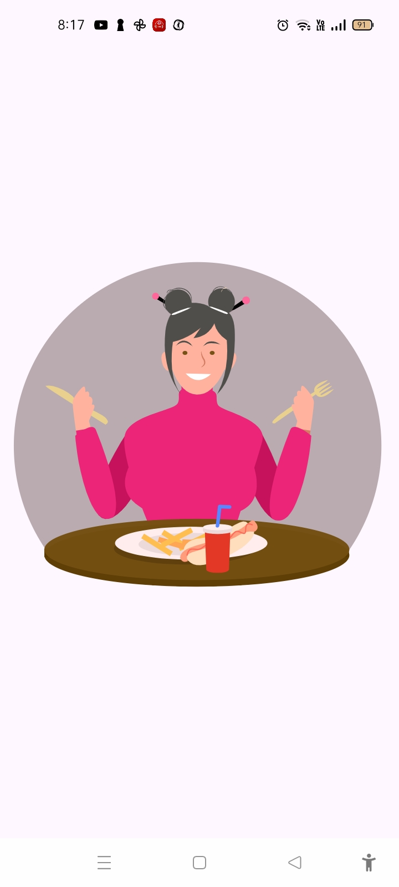
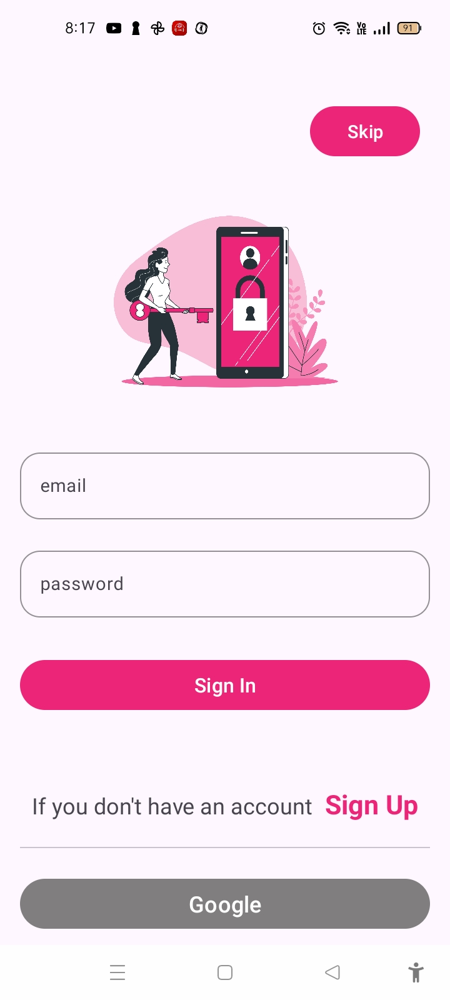
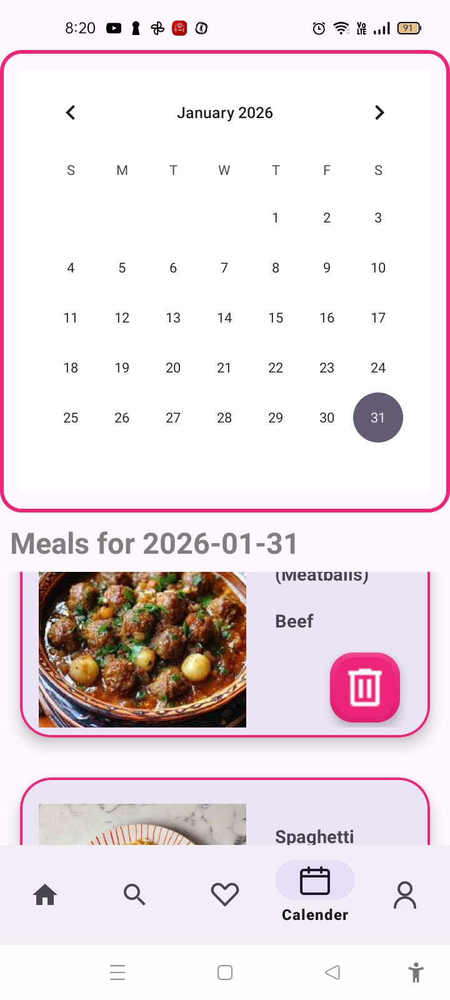
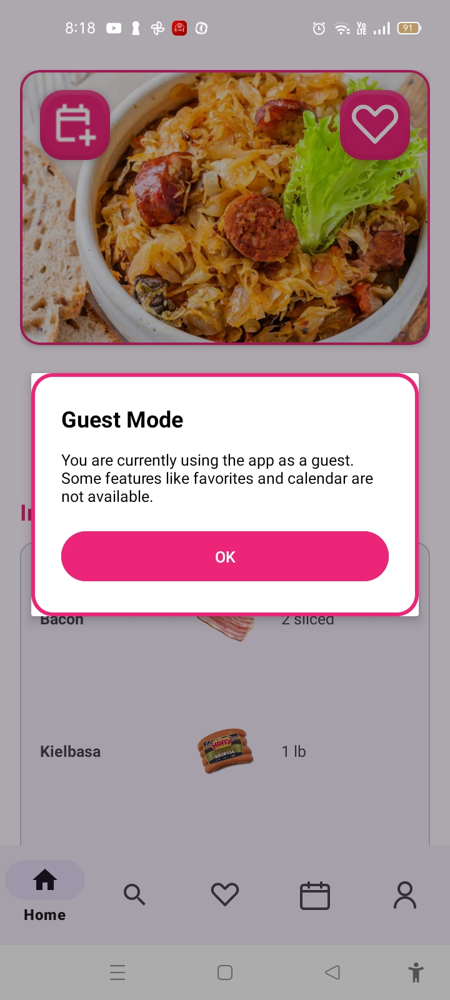
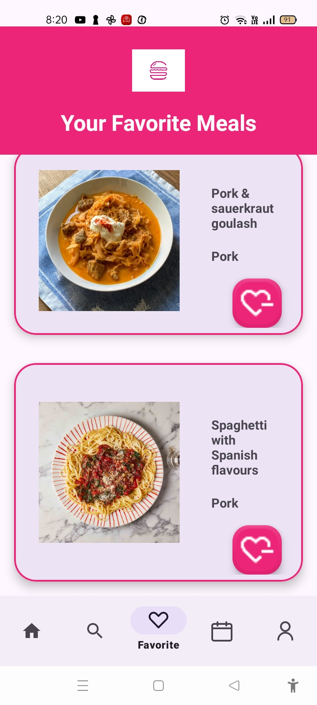
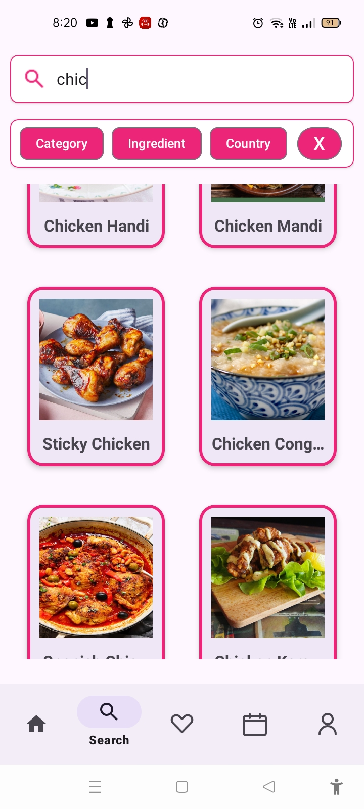
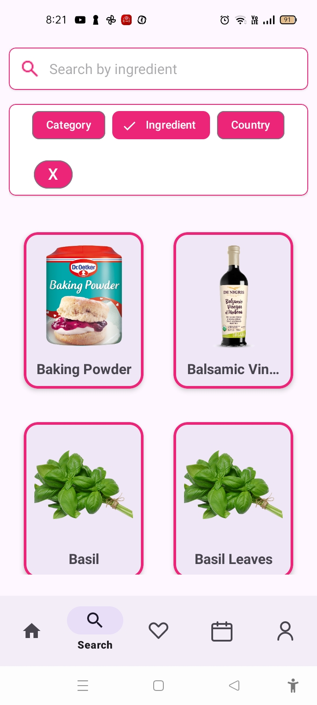
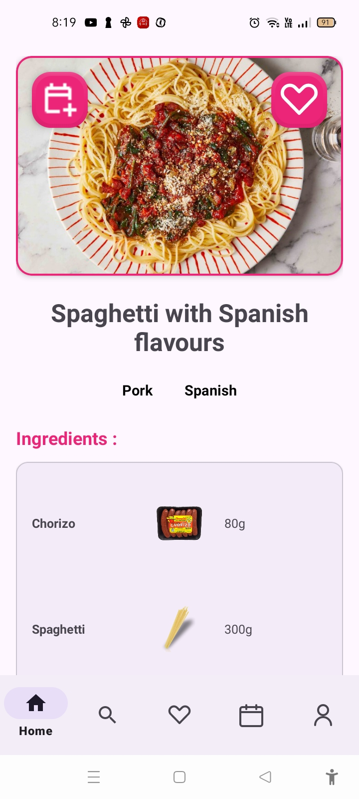
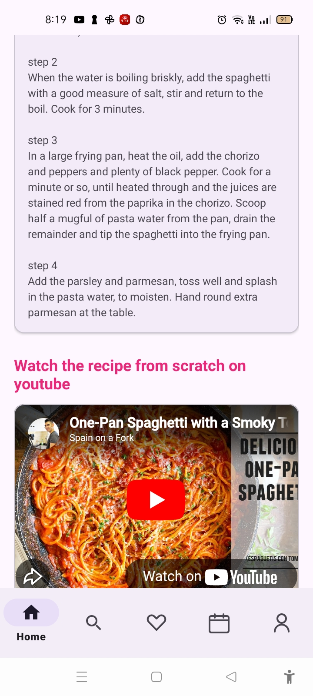
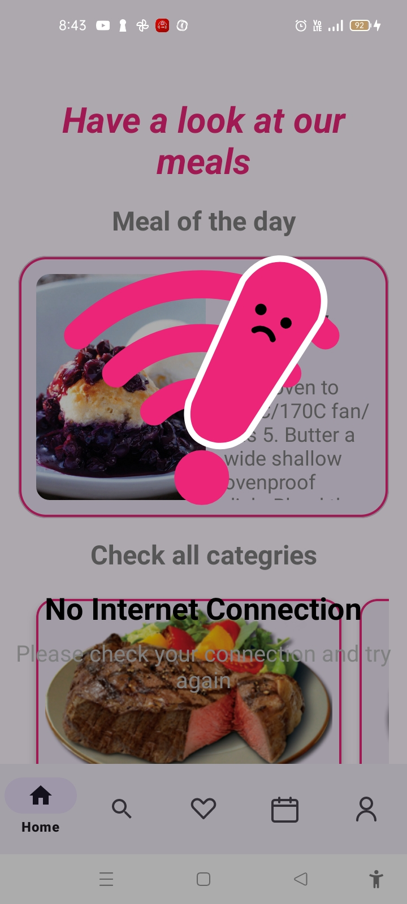

# 🍔 FoodPlanner App

A full-featured mobile app for discovering meals, managing favorites, and exploring recipes with Java, MVP architecture, RxJava, Room Database, and Firebase Authentication.
## 📖 Description
FoodPlanner allows users to:
-Browse meals 
-View detailed meal information
-Add meals to favorites
-Add meals to calender
ِ-Search and filter meals
-Login with Email/Password, Google Sign-In, or Guest account

The app uses:
- MVP architecture for clean separation of concerns
- RxJava3 for async and reactive operations
- Retrofit2 for API requests
- Firebase Authentication for login methods
- Room Database for storing favorites and offline caching
- Gson for JSON parsing

## ✨ Features

- Display meals by categories
- Search meals with live updates
- View meal details including ingredients , instructions and youtube video
- Add/remove meals from favorites and calender
- Offline caching of favorites using Room
- Smooth reactive UI updates using RxJava
- Login via Email/Password, Google, or Guest account
- Modular MVP structure for maintainable code
- Proper error handling for network/API issues
## 🖼 Screenshots

  
  
  
  
  

  
  
  
  
  

## 🛠 Technologies Used

- Java 25
- Android SDK
- RxJava3
- Retrofit2
- Gson

  
## 🧩 System Architecture
### MVP Structure
- Model: Handles API calls and data sources (local DB, remote API)

- View: Activities/Fragments display UI and communicate with Presenter

- Presenter: Handles business logic, interacts with Model, updates View via RxJava streams

## ▶ How to Run
Requirements

- Android Studio Bumblebee or higher
- Java 17+
- Internet access for API

Steps

- Clone the repository:
git clone https://github.com/shahdashraf2003/FoodPlanner
- Open in Android Studio
-  Sync Gradle
- Run on emulator or device
- Explore meals, search, and manage favorites
  
## ⚠ Error Handling

- Handles network errors gracefully
- Shows empty state if no meals found
- Prevents crashes with proper null checks and RxJava error handling

## 👤 Developer

Shahd Ashraf
